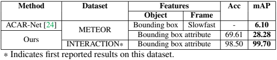

# Driving Through Graphs: A Bipartite Graph for Traffic Scene Analysis
[Read the Paper](https://ieeexplore.ieee.org/document/10647492)

# Abstract
We introduce a novel approach for traffic scene analysis in driving videos by exploring spatio-temporal relationships captured by a temporal frame-to-frame (f2f) bipartite graph, eliminating the need for complex image-level high-dimensional feature extraction. Instead, we rely on object detectors that provide bounding box information. The proposed graph approach efficiently connects objects across frames where nodes represent essential object attributes, and edges signify interactions based on simple spatial metrics such as distance and angles between objects. A key innovation is the integration of dynamic edge attributes, computed using Multilayer Perceptrons (MLP) by exploring this spatial metric. These attributes enhance our Interaction-aware Graph Neural Networks (IA-GNNs) framework by adapting the PageRank-driven approximate personalized propagation of neural predictions (APPNP) scheme and graph attention mechanism in a novel way. This has significantly improved our model’s ability to understand spatio-temporal interactions of multiple objects in traffic scenarios. We have rigorously evaluated our approach on two benchmark datasets, METEOR and INTERACTION, demonstrating its accuracy in analyzing traffic scenarios. This streamlined, graph-based strategy marks a significant shift towards more efficient and insightful traffic scene analysis using video data

## Interaction Aware Graph Neural Network (IA-GNN)

**Interaction Aware Graph Neural Network (IA-GNN)** is a specialized type of Graph Neural Network designed to model and analyze interactions between multiple objects in a dynamic environment. In the context of traffic scene analysis, IA-GNN processes a graph where nodes represent objects (e.g., vehicles, pedestrians) and edges capture interactions or relationships between these objects.

### Key Features of IA-GNN:
- **Dynamic Edge Attributes**: IA-GNN uses multilayer perceptrons (MLPs) to compute edge features, which represent the interactions between objects. These edge features are dynamically updated to reflect changing relationships over time.
- **Spatio-Temporal Modeling**: By incorporating temporal information through frame-to-frame bipartite graphs, IA-GNN captures both spatial and temporal dependencies, enabling accurate prediction of events in traffic scenes.
- **Attention Mechanisms**: The model can prioritize important interactions by assigning different weights to edges, allowing it to focus on the most relevant object relationships for a given task.

Overall, IA-GNN improves the understanding of complex multi-object interactions, making it well-suited for tasks like traffic scene classification and autonomous driving.

# Results

## Performance Comparison
Our model outperforms state-of-the-art methods on both accuracy and mean average precision (mAP) on the [METEOR Dataset](https://gamma.umd.edu/researchdirections/autonomousdriving/meteor/) and the [INTERACTION Dataset](https://interaction-dataset.com/).

## License
Distributed under the MIT License. See `LICENSE` for more information.

## Acknowledgements
- This research was partially funded by the UKRI EPSRC project ATRACT (EP/X028631/1): A Trustworthy Robotic Autonomous System for Casualty Triage.
